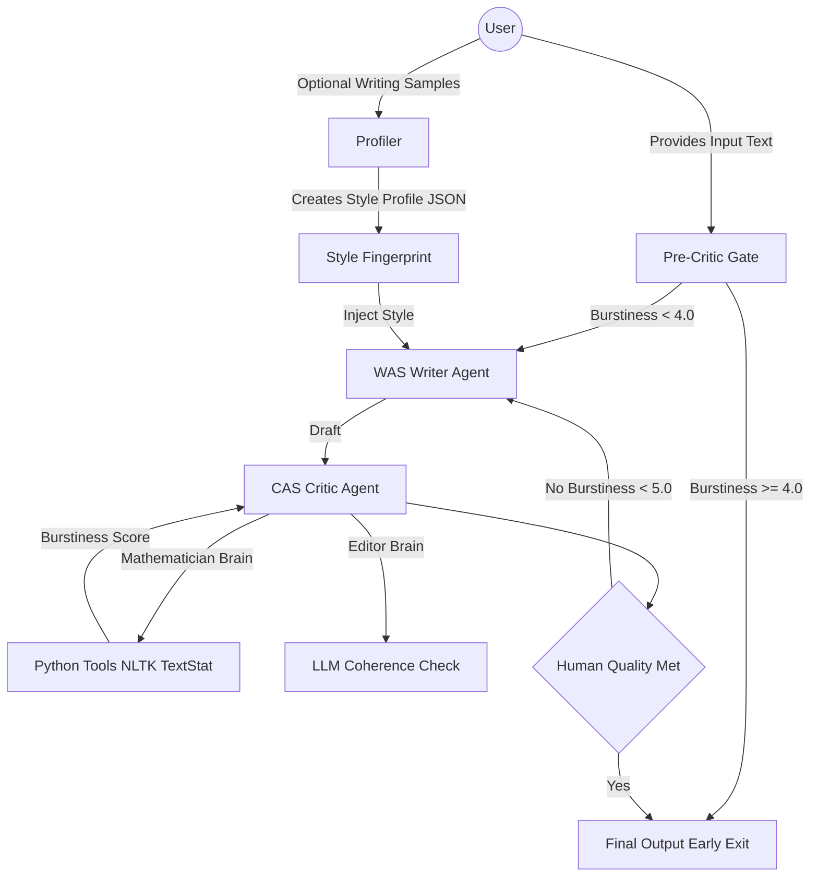

<div align="center">
  
  <h1>HumanInk </h1>
</div>

> **The AI Text Humanizer that doesn't just "rewrite" — it clones your style.**


**HumanInk** is a personalized AI writing assistant that rewrites and refines AI Generated text to match a specific human writing style, improving clarity, natural flow, and stylistic consistency while preserving the original meaning. Unlike generic rewriters that simply synonym-swap, HumanInk uses a **Reflexion Loop** — an iterative Draft → Critique → Refine pipeline — where a Writer agent generates text and a Critic agent evaluates it using quantitative linguistic metrics and semantic checks. The system repeats this loop until the output meets human-like quality thresholds or exits early when input is already sufficient.


---

## 🌟 The "Secret Sauce"

Most humanizers sound like "different AI." HumanInk sounds like **YOU**.

### 1. The Personal Style Profiler 🕵️‍♂️
Before writing a single word, our **Profiler Agent** analyzes your past writing (emails, essays, blogs) to extract your unique **Style Fingerprint**:
*   **Sentence Rhythm:** Do you use punchy short sentences? or long, academic ones?
*   **Vocabulary:** Do you say "utilize" or "use"?
*   **Quirks:** Do you use em-dashes? Do you start sentences with "And"?

### 2. The Adversarial Loop (Writer vs. Critic) ⚔️
We don't just output the first draft. We simulate an editor-writer fight:
*   **The Writer (Agent A):** Drafts content using your *Style Fingerprint*.
*   **The Critic (Agent B):** An aggressive "Detective" agent equipped with **Python Tools** (NLTK, TextStat). It calculates:
    *   **Burstiness:** The standard deviation of sentence lengths.
    *   **Perplexity:** The unpredictability of vocabulary.
*   **The Loop:** If the Critic says "Too robotic (Variance < 3.0)", the Writer **rewrites it** until it passes.

---

## 🏗️ Architecture



---

## 🛠️ Tech Stack

*   **Backend:** Python (FastAPI)
*   **Orchestration:** LangGraph (Cyclic flow control)
*   **AI Models:**
    *   **Writer/Profiler:** Gemini Flash Preview (High Speed/Creativity)
    *   **Critic:** Llama 3 70B (via Groq) + Python Analysis Tools
*   **Analysis Tools:** `nltk`, `textstat`, `numpy`

---

## 🚀 Getting Started

### Prerequisites
*   Python 3.10+
*   Gemini API Key (Google AI Studio)
*   Groq API Key (for Llama 3)

### Installation

1.  **Clone the repository:**
    ```bash
    git clone https://github.com/yourusername/humanink.git
    cd humanink
    ```

2.  **Install Backend Dependencies:**
    ```bash
    cd backend
    pip install -r requirements.txt
    ```

3.  **Set up Environment Variables:**
    Create a `.env` file in `backend/`:
    ```env
    GOOGLE_API_KEY=your_gemini_key_here
    GROQ_API_KEY=your_groq_key_here
    
    ```

4.  **Run the Profiler Test:**
    ```bash
    python backend/test_profiler.py
    ```

## 🤝 Contributing

We welcome contributions! Please follow these steps:

1.  Fork the repository.
2.  Create a new branch: `git checkout -b feature/your-feature-name`.
3.  Make your changes and commit them: `git commit -m 'Add some feature'`.
4.  Push to the branch: `git push origin feature/your-feature-name`.
5.  Submit a pull request.


