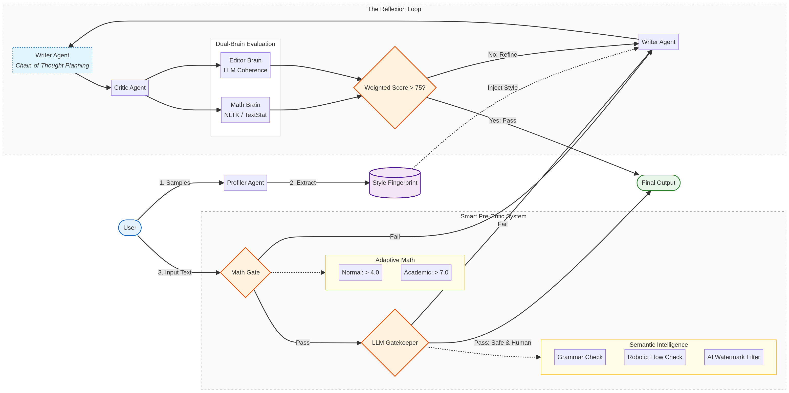

<div align="center">
  
  <h1>HumanInk</h1>
  <p><strong>The AI Text Humanizer that doesn't just "rewrite" — it clones your digital DNA.</strong></p>
</div>

<p align="center">
  
  
  
  
  
  
  
</p>

**HumanInk** is a multi-agent AI pipeline that rewrites LLM-generated text to authentically match a user's unique human neural rhythm. Unlike generic rewriters that simply synonym-swap, HumanInk uses an adversarial **Reflexion Loop** — an iterative Draft → Critique → Refine pipeline powered by LangGraph. It now ships with a full-featured **Premium React SaaS frontend**, **Clerk Authentication**, **Supabase cloud storage**, **Multiple DNA Profiles**, and a **real-time SSE streaming** command center.

---

## 🆚 Real-World Comparison

We took a standardized **ChatGPT-generated bio** and processed it through leading competitors (*"Humanise AI"* and *"aihumanize.io"*) versus **HumanInk** (using a casual DNA profile).

| Feature |  Humanise AI |  aihumanize.io |  HumanInk (Custom DNA) |
| :--- | :--- | :--- | :--- |
| **Opening Hook** | *"Presently, I am finishing..."* <br> *(Passive, wordy)* | *"I am a senior... **is** studying..."* <br> *(Grammar Error! Clunky)* | *"I'm currently an undergrad..."* <br> *(Direct, active, clean)* |
| **Sentence Structure** | *"One of the most favorite projects..."* <br> *(Awkward rhythm)* | *"...through the building of... where capabilities are applied in conjunction..."* <br> *(Painful run-on sentence)* | *"Lately, I've been leading..."* <br> *(Natural flow)* |
| **Quirks & Style** | *"Most of my time has been utilized to dive deep..."* <br> *(Robotic filler)* | *"My primary passion is... fortunate to lead..."* <br> *(Generic Cover Letter style)* | *"I love the challenge of building—especially when it's hard."* <br> *(Enforced em-dash, authentic passion)* |
| **Verdict** | **FAIL:** Thesaurus shuffle. | **FAIL:** Structural & Grammar issues. | **WIN:** Sounds exactly like the author. |

---

## ✨ What's New

### 🧬 Multiple DNA Profiles (New!)
- **Profile Dashboard:** Extract, save, and manage multiple unique writing styles. Switch between them instantly.
- **Strict Quirk Enforcement:** The system doesn't just copy your tone; it mathematically enforces your specific punctuation habits (like em-dashes or Oxford commas).
- **Cloud Sync:** Fully authenticated via Clerk and backed by Supabase PostgreSQL. Your DNA goes where you go.

### 🎚️ Paraphrase Depth Control (New!)
- **Light Touch:** Fixes robotic phrasing while strictly maintaining original length and structure.
- **Balanced:** Restructures sentences and maps vocabulary to your DNA, strictly enforcing a ±5% word count margin.
- **Full Reconstruction:** Complete narrative freedom to break up paragraphs, add storytelling hooks, and expand length dynamically (capped at 125%).

### 🎓 Academic Mode & LaTeX Support
- **Discipline-Specific Baseline:** Calibrated profiles for Computer Science, Medicine, Humanities, etc.
- **Smart Section Detection:** Automatically adjusts tone based on the paper section (e.g., *Results* vs. *Discussion*).
- **100% LaTeX-Safe:** Math environments, citations, and formulas are fully preserved and re-injected automatically.

### 🖥️ Premium UX & Command Center
- **Cinematic Frontend:** Fully glassmorphic design featuring kinetic typography, smooth CSS transitions, and an interactive agent pipeline rail.
- **Live SSE Streaming:** Watch the agents "think" and process in real-time with near-zero latency.

---

## 🌟 The Pipeline — "Secret Sauce"

### 1. The Profiler Agent 🕵️
Before rewriting anything, the **Profiler Agent** processes your writing samples to extract a **Style Fingerprint** covering:
- **Sentence Rhythm** (Short punchy cadences vs. long compound academic sentences)
- **Vocabulary** (Formal elevated language vs. everyday casual terminology)
- **Quirks & Habits** (Em-dash frequency, conjunction openers, Oxford comma usage)

### 2. The Gatekeeper 🚪
Multi-stage screening before entering the loop:
- **Adaptive Math:** Burstiness score threshold adjusts based on average sentence length.
- **Semantic Intelligence:** LLM scans for grammar errors, run-on sentences, and "AI Watermarks" (words like *delve*, *tapestry*, *testament*).

### 3. The Reflexion Loop (Writer & Critic) ⚔️
- **The Writer Agent ✍️:** Analyzes robotic patterns, plans targeted changes, and enforces your exact stylistic DNA constraints based on your chosen Paraphrase Depth.
- **The Critic Agent ⚖️:** Evaluates the draft using a weighted Human Score formula (`Burstiness` + `Vocabulary` + `Coherence`). If it scores < 75, feedback is sent back to the Writer for a retry.

---

## 🏗️ Architecture



## 🛠️ Tech Stack

| Layer | Technology |
|---|---|
| **Frontend** | React 18, Vite, Tailwind CSS v3.4, Clerk |
| **Backend** | Python, FastAPI, Uvicorn, Supabase |
| **AI Orchestration** | LangGraph (cyclic StateGraph) |
| **Writer / Profiler** | Gemini Flash Preview (high creativity) |
| **Critic / Gatekeeper** | Llama 3.3 70B / Llama 3.1 8B via Groq |
| **Analysis Tools** | `nltk`, `textstat`, `numpy` |

---

## 🚀 Getting Started

### Prerequisites
- Python 3.10+
- Node.js 18+
- Gemini API Key (Google AI Studio)
- Groq API Key (for Llama 3 agents)
- Clerk API Keys (Frontend)
- Supabase API Keys (Backend)

### Installation

1. **Clone & Install Backend:**
    ```bash
    git clone https://github.com/ShaikNelofer2004/humanink.git
    cd humanink/backend
    pip install -r requirements.txt
    ```

2. **Install Frontend:**
    ```bash
    cd ../frontend
    npm install
    ```

3. **Set up Environment Variables:**
    **Backend (`backend/.env`):**
    ```env
    GOOGLE_API_KEY=your_gemini_key_here
    GROQ_API_KEY=your_groq_key_here
    OPENROUTER_API_KEY=your_openrouter_key_here
    GROQ_API_KEY_GATEKEEPER=your_gatekeeper_key_here
    SUPABASE_URL=your_supabase_url
    SUPABASE_KEY=your_supabase_service_key
    ```
    
    **Frontend (`frontend/.env`):**
    ```env
    VITE_CLERK_PUBLISHABLE_KEY=your_clerk_key
    ```

### Running Locally

1. **Start the Backend:**
    ```bash
    cd backend
    python -m uvicorn main:app --reload --port 8000
    ```

2. **Start the Frontend:**
    ```bash
    cd frontend
    npm run dev
    ```
    Open `http://localhost:5173` in your browser.

---

## 📁 Project Structure

```
HumanInk/
├── backend/
│   ├── agents/
│   │   ├── writer.py          # Writer Agent (academic + normal mode, length/quirk enforcement)
│   │   ├── critic.py          # Critic Agent (dual-brain evaluation)
│   │   ├── gatekeeper.py      # Gatekeeper Agent (math + semantic)
│   │   └── profiler.py        # Profiler Agent (DNA extraction)
│   ├── graph.py               # LangGraph StateGraph pipeline
│   ├── database.py            # Supabase interactions
│   ├── latex_utils.py         # LaTeX pre/post processor + field profiles
│   ├── main.py                # FastAPI routes, SSE streaming, Auth
│   ├── utils.py               # Burstiness calculation utilities
│   └── .env                   # API keys (not committed)
├── frontend/
│   └── src/
│       ├── components/
│       │   ├── Home.jsx             # Landing page
│       │   ├── Extraction.jsx       # DNA setup + Academic Mode flow
│       │   ├── Workspace.jsx        # 50/50 split command center
│       │   ├── ProfileDashboard.jsx # Multi-profile management
│       │   └── StatsPanel.jsx       # Telemetry strip
│       ├── App.jsx             # Routing state machine & top-level state
│       └── index.css           # Tailwind + custom animations
└── README.md
```

---

## 🗺️ Roadmap

See [`PRODUCT_ROADMAP.md`](PRODUCT_ROADMAP.md) for the full technical roadmap. Key upcoming features:

| Priority | Feature | Status |
|---|---|---|
| ✅ | Multiple DNA Profile Slots | **Done** |
| ✅ | Cloud DB & Authentication | **Done** |
| 🔴 P0 | Deliberate Imperfection Agent | Pending |
| 🔴 P0 | Token-by-token streaming output | Pending |
| 🟡 P1 | Syntactic Reconstructor Agent | Pending |
| 🟢 P2 | Chrome Extension | Pending |
| 🔵 P3 | API-First B2B Tier | Pending |

---

<div align="center">
  <p>© 2026 HumanInk · Authentic Identity · Zero Fluff</p>
</div>
